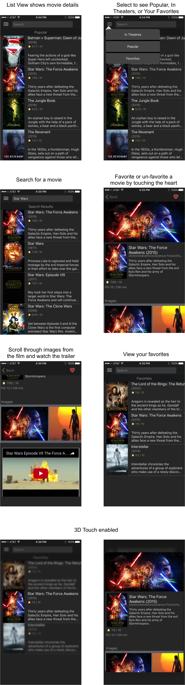

Hello, And Welcome To... Movie Phone

Movie Phone is a iOS app built using Swift. Movie Phone gets its information from The Movie Database. Use Movie Phone to search for a
movie, view movies in theaters, and view popular movies. Once a movie is selected, you can view images from the film and watch the trailer.
A user can also favorite a movie by pressing the heart. If it is decided that a movie is not a favorite anymore, the user can unfavorite 
by pressing the heart again. 3D touch peek and pop is enabled in the list view to preview the detail page.
Enjoy Movie Phone!

